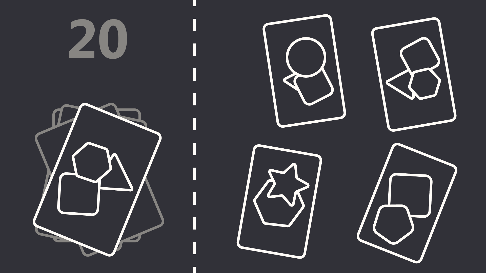

# Reaction Game
Game focused on reaction time

Player has to match card on the left with one card of the right.    
Main way of ramping up difficulty is by rotating cards or adding new ones.

Gameplay Loop:   
&nbsp;&nbsp; ... → **New cards on table** → **Card is choosen** → **Points are added** → ...
            
